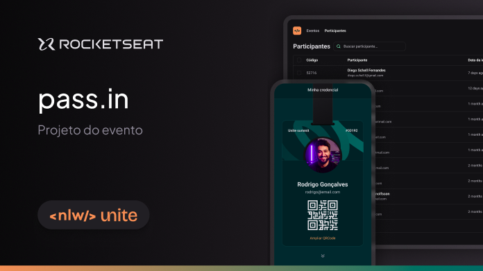

# Pass in Web (frontend)

## Description - pass.in

O pass.in é uma aplicação de **gestão de participantes em eventos presenciais**.

A ferramenta permite que o organizador cadastre um evento e abra uma página pública de inscrição.

## Layout

* [Figma](https://www.figma.com/community/file/1356738933008624188/unite-summit)

## Repositório

* [GitHub - frontend](https://github.com/vbruno/)

## 🛠 Tecnologias

As seguintes ferramentas foram usadas na construção do projeto:

* [React](https://pt-br.reactjs.org/)
* [TailwindCSS](https://tailwindcss.com/)
* [Lucide Icons](https://lucide.dev/)

### Pré-requisitos

Antes de começar, você vai precisar ter instalado em sua máquina as seguintes ferramentas:

* [Git](https://git-scm.com)
* [Node](https://nodejs.org/en/)

Além disto é bom ter um editor para trabalhar com o código como [VSCode](https://code.visualstudio.com/)
e um software para testar as rotas como [Insomnia](https://insomnia.rest/download)

### Autor

---
 
<a href="https://github.com/vbruno/">
  
   
</a>
<b>Bruno S Velho 🚀</b>

Feito com ❤️ por Bruno S Velho 👋🏽 Entre em contato!

